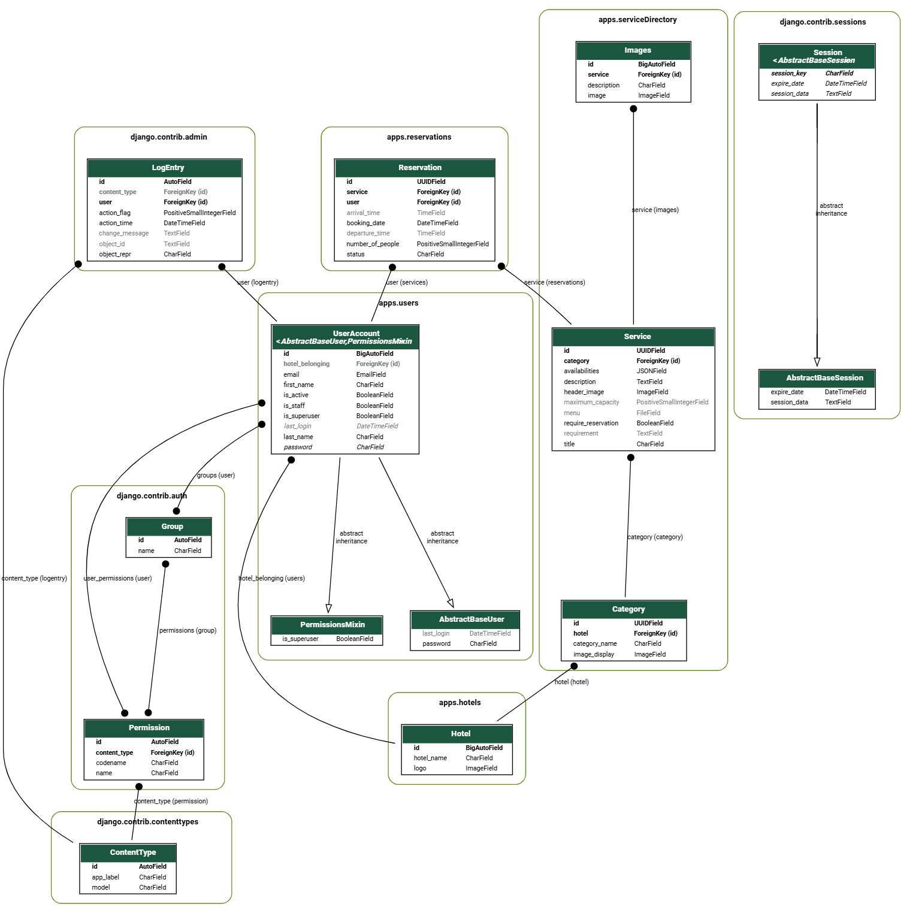

# Booking House Backend
## Backend database structure:


## View the [Booking House Front end](https://github.com/Alberto200420/bookingHouse-frontend/tree/mvp)

## Booking House

**Booking House** is a project that allows hotel guests to access a catalog of services via their smartphones. Guests can explore activities, services, and tours offered by the hotel where they are staying.

The application supports a multi-hotel management system, enabling a hotel corporation or an owner of multiple hotels to register hotels, manage categories, and offer services dynamically. Each hotel gets a unique, dynamically generated URL for guests to access.

For example, the Buenaventura hotel corporation can register its hotels: "Buenaventura," "Hacienda Buenaventura," and "Villa Premier." The system saves these in the database along with the hotel logo and creates a unique URL for each hotel:

- `https://[DOMAIN]/buenaventura/`
- `https://[DOMAIN]/haciendabuenaventura/`
- `https://[DOMAIN]/villapremier/`

## Key Features

- **Multi-hotel management**: Register and manage multiple hotels under a single account.
- **Easy booking for a guests**: Guests can see the services and see the full content of these (images, description, menu, if it need a reservation) and at the time of booking it is a simple log in then rebook and (a confirmation email must be sent which this MVP does not do).
- **Service catalog**: Guests can browse through services, activities, and tours available at the hotel.

## Dynamic URL Structure

Each hotel will have its own dynamically generated URL:

- `https://[DOMAIN]/[REGISTERED HOTEL]/`


This ensures that each hotel has its own unique service catalog and offerings, accessible by its guests.

## Models Overview

### UserAccount (`apps.users`)
Represents a user account within the system. Inherits from `AbstractBaseUser`. Key fields include:
- `first_name`, `last_name`
- `email`
- `is_superuser`
- `password`

### Hotel (`apps.hotels`)
Represents individual hotels. Key fields include:
- `hotel_name`
- `logo`
- `image`

Each hotel is accessed via its unique dynamic URL.

### Service (`apps.serviceDirectory`)
Represents services offered by the hotels. Key fields include:
- `title`
- `description`
- `availabilities` (dictionary storing available times or days)
- `category` (relation to `Category` model)

### Category (`apps.serviceDirectory`)
Represents service categories (e.g., "Spa", "Tours"). Key fields include:
- `title`
- `image_display`

### Images (`apps.serviceDirectory`)
Stores images associated with services. Each image is linked to a service via a `ForeignKey`.

### Reservation (`apps.reservations`)
Handles guest reservations for specific services. Key fields include:
- `booking_time`
- `number_of_people`
- `status`

### LogEntry (`django.contrib.admin`)
Stores logs of changes made via the admin panel.

### Session (`django.contrib.sessions`)
Manages user sessions. Stores data about the user's session activities.

### Permission (`django.contrib.auth`)
Manages user permissions and groups. Controls access to views and functionality.

## Views Overview

### Service Directory

#### `GetTodayServices`
- Fetches services available on the current day (e.g., Monday).
  
```python
class GetTodayServices(APIView):
  def get(self, request):
    today = datetime.now().strftime('%A')
    services_today = Service.objects.filter(availabilities__has_key=today)
    serializer = TodayServiceSerializer(services_today, many=True, context={'today': today})
    return Response(serializer.data)
```

#### `GetCategory_and_ServiceList`
- Fetches all available categories along with the services in those categories.

```python
class GetCategory_and_ServiceList(APIView):
  def get(self, request):
    categories = Category.objects.all()
    serializer = CategorySerializer(categories, many=True)
    return Response(serializer.data)
```
`GetService`
- Fetches details for a specific service by its service_id.

```python
class GetService(APIView):
  def get(self, request, service_id):
    service = get_object_or_404(Service, id=service_id)
    serializer = ServiceSerializer(service)
    return Response(serializer.data)
```
### Reservations
`ReserveUsers`
- Allows users to create a reservation for a service. The reservation includes details like booking_time and number_of_people.

```python
class ReserveUsers(APIView):
  def post(self, request):
    serializer = ReservationCreateSerializer(data=request.data, context={'request': request})
    if serializer.is_valid():
      reservation = serializer.save()
      return Response({"message": "Reservation created successfully", "reservation_id": reservation.id}, status=status.HTTP_201_CREATED)
    return Response(serializer.errors, status=status.HTTP_400_BAD_REQUEST)
```
### Hotels
`GetHotelHomePage`
- Fetches homepage information for a specific hotel based on the hotel_name.
python

```python
class GetHotelHomePage(APIView):
  def get(self, request, hotel_name):
    hotel = get_object_or_404(Hotel, hotel_name=hotel_name)
    serializer = GetHotelHomePageSerializer(hotel)
    return Response(serializer.data)
```

### This branch is just the MVP of the aplication 
